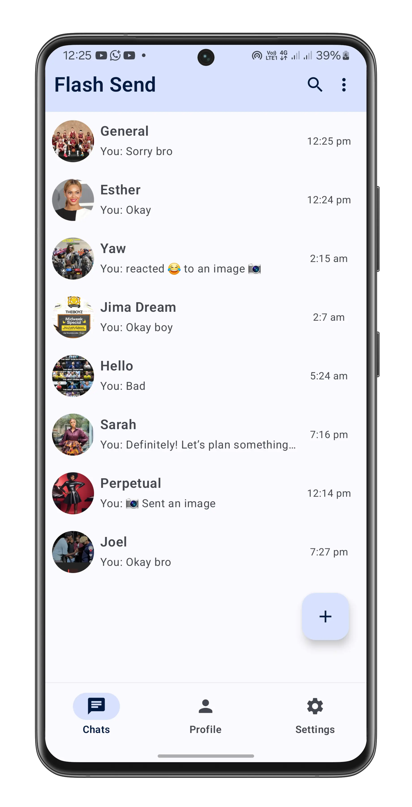
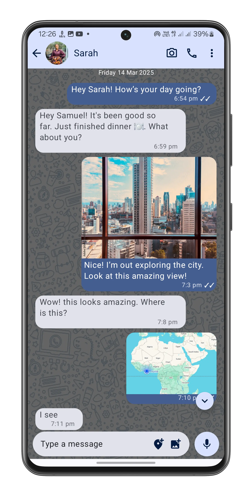
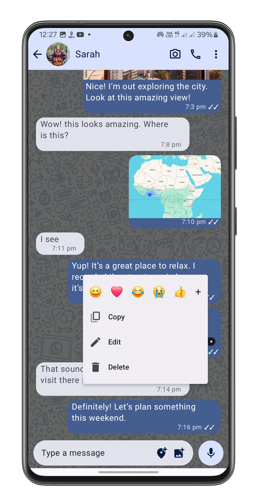
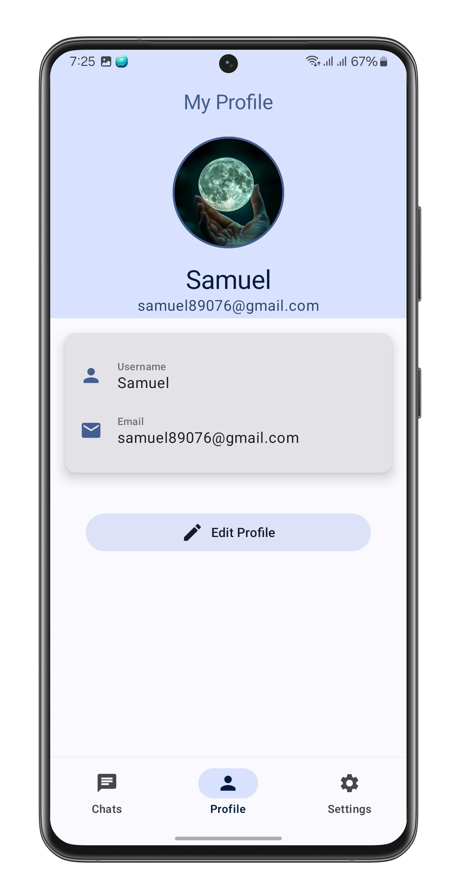
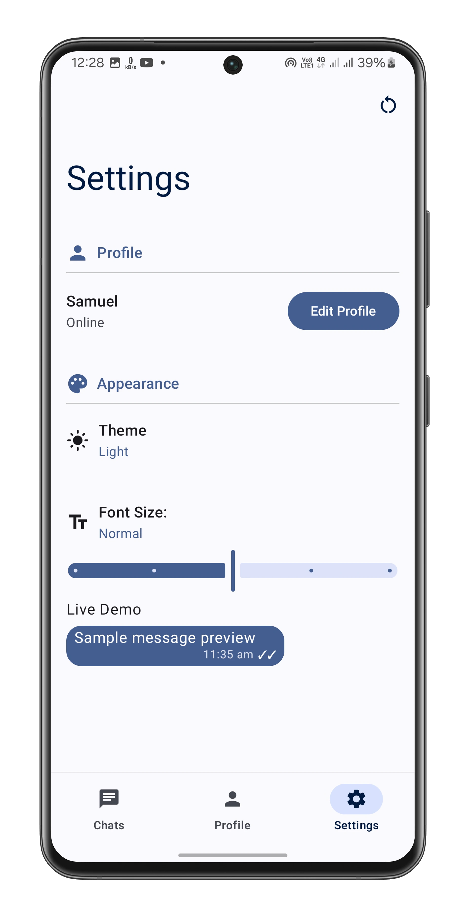
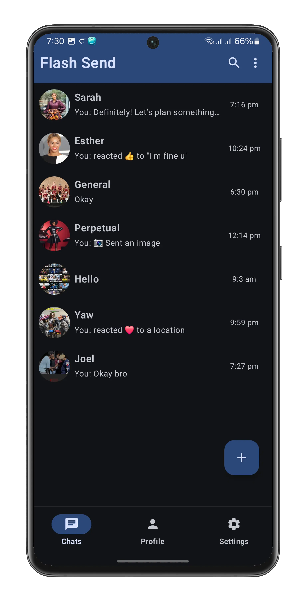
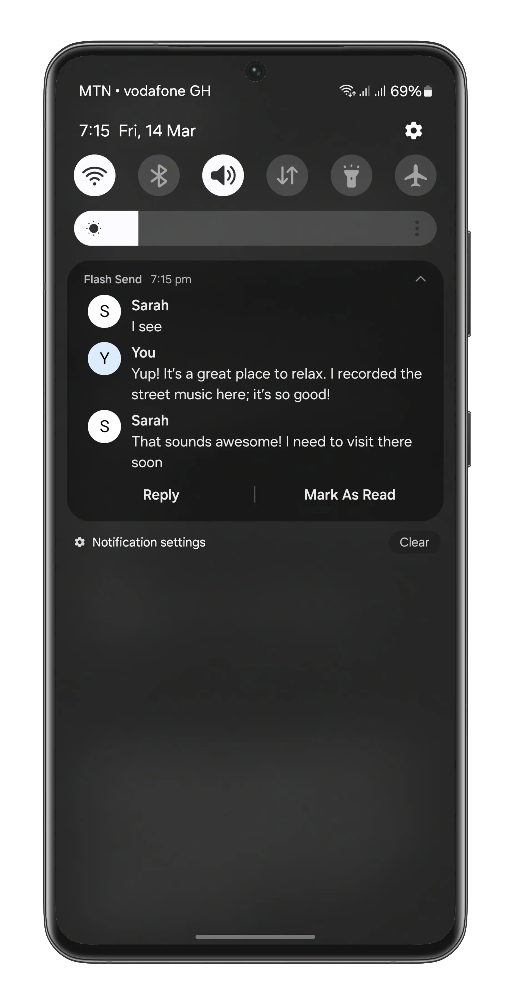

   

# Flash Send

A modern Android chat application that enables real-time messaging with a clean, intuitive interface.

## Screenshots

    
    
    
    
    
    
    
    

## Features

- **Real-time messaging**: Instantly send and receive text messages
- **Media sharing**: Share images, audio messages, and location data
- **Read receipts**: See when your messages have been read
- **Message reactions**: React to messages with emojis
- **Message management**: Edit and delete your sent messages
- **Modern UI**: Built with Material 3 and Jetpack Compose
- **Dark/Light themes**: Customizable appearance based on user preference
- **Notifications**: Push notifications for new messages with reply and mark as read functionality
- **User profiles**: View and edit your profile information
- **Firebase integration**: Authentication, real-time database, cloud messaging
- **Camera integration**: Take photos directly within the app
- **Offline support**: Basic functionality when offline with automatic reconnection

## Installation

1. Clone this repository
2. Create a Firebase project and add your `google-services.json` file to the app directory
3. Configure Firebase with Authentication, Realtime Database, Storage, and Cloud Messaging
4. Build and run the application

## Contributing

Contributions are welcome! If you'd like to contribute, please:

1. Fork the repository
2. Create your feature branch (`git checkout -b feature/amazing-feature`)
3. Commit your changes (`git commit -m 'Add some amazing feature'`)
4. Push to the branch (`git push origin feature/amazing-feature`)
5. Open a Pull Request

## License

This project is licensed under the MIT License - see the LICENSE file for details.
