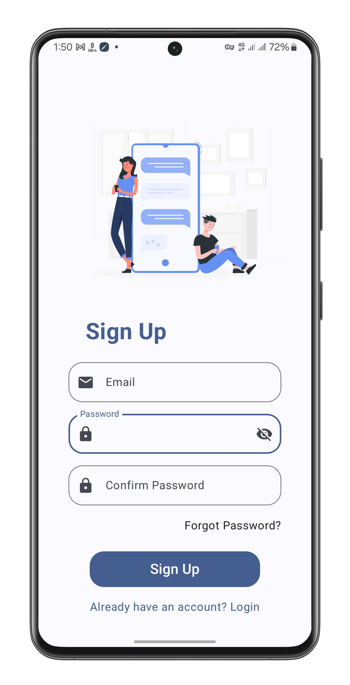

# Flash Send

A modern Android chat application built with Jetpack Compose that enables real-time messaging with a clean, intuitive interface.

## Features

- **Real-time messaging**: Instantly send and receive text messages
- **Media sharing**: Share images, audio messages, and location data
- **Read receipts**: See when your messages have been read
- **Message reactions**: React to messages with emojis
- **Message management**: Edit and delete your sent messages
- **Modern UI**: Built with Material 3 and Jetpack Compose
- **Dark/Light themes**: Customizable appearance based on user preference
- **Notifications**: Push notifications for new messages with reply and mark as read functionality
- **User profiles**: View and edit your profile information
- **Firebase integration**: Authentication, real-time database, cloud messaging
- **Camera integration**: Take photos directly within the app
- **Offline support**: Basic functionality when offline with automatic reconnection

## Screenshots 📱

Here are some screenshots of the app:

<div style="display: flex; flex-wrap: wrap; justify-content: center; gap: 1px;">
    
    
    
    
    
    
    
    
</div>

## Tech Stack

### Frontend

- **Jetpack Compose**: Modern UI toolkit for building native Android UI
- **Material 3**: Latest Material Design components and theming
- **Kotlin Coroutines & Flow**: For asynchronous programming and reactive streams

### Backend & Services

- **Firebase Authentication**: User authentication and management
- **Firebase Realtime Database**: Data storage and synchronization
- **Firebase Cloud Messaging (FCM)**: Push notifications
- **Firebase Storage**: Media file storage

## Installation

1. Clone this repository
2. Create a Firebase project and add your `google-services.json` file to the app directory
3. Configure Firebase with Authentication, Realtime Database, Storage, and Cloud Messaging
4. Add your Google Maps API key in the manifest (for location sharing feature)
5. Build and run the application

## Project Structure

```
com.aubynsamuel.flashsend/
├── auth/                  # Authentication related components
├── chatRoom/              # Chat functionality and UI
│   └── messageTypes/      # Different message type renderers
├── functions/             # Utility and helper functions
├── home/                  # Home screen and related components
├── navigation/            # Navigation components and routing
├── notifications/         # Push notification handling
├── settings/              # User preferences and settings
└── ui/                    # Theme and UI components
```

## Setup Requirements

- Android Studio Iguana or later
- Minimum SDK: 21 (Android 5.0)
- Target SDK: 34 (Android 14)
- Kotlin 1.9.0 or later
- Google Play Services for location features
- Firebase project with necessary services enabled

## Contributing

Contributions are welcome! If you'd like to contribute, please:

1. Fork the repository
2. Create your feature branch (`git checkout -b feature/amazing-feature`)
3. Commit your changes (`git commit -m 'Add some amazing feature'`)
4. Push to the branch (`git push origin feature/amazing-feature`)
5. Open a Pull Request

## License

This project is licensed under the MIT License - see the LICENSE file for details.
